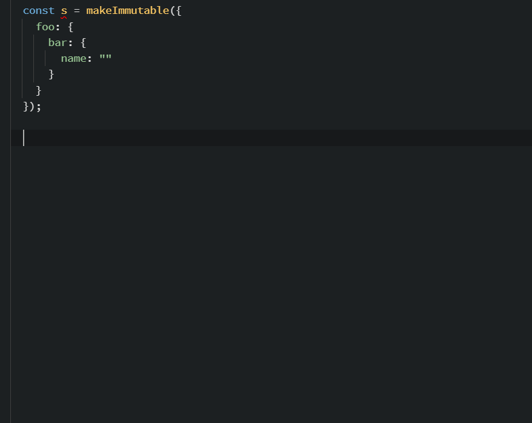

immuts
=====

Type-safe, generic immutable datastructure for Typescript. Does not require manually setting JS paths `["a", "b", "c"]` and allows TS autocompleted drilldown.



## Changelog
 
 * **2.1.0** - Adding some array helpers
 * **2.0.1** - Vastly simplified 
 * **0.4.5** - Added some methods for dealing with native arrays
 * **0.4.0** - Removed incomplete immutablejs adapter for now
 * **0.3.0** - Improved support for working with arrays and maps

## Usage 

### Simple

```TypeScript
interface IA {
    id: number;
    name: string;
}

let a1 = makeImmutable<IA>({  
    id: 42,
    name: "foo"
});

let a2 = a1.__set(x => x.id, 23);

// a1 !== a2 => true

let a3 = a2.__set(x => x.id, "23"); // Results in compiler error, string cannot be assigned to number
```

### Updating multiple properties

```TypeScript
interface IA {
    id: number;
    name: string;
}

interface IB {
    a1: IA;
    a2: IA;
}

interface IC {
    b: IB;
}

let c = makeImmutable<IC>({
        b: {
            a1: {  
                id: 42,
                name: "foo"
            }, 
            a2: {
                id: 23,
                name: "bar"
            }
        }
    });

let c2 = c.__set(x => x.b.a1, x => ({
    ...x,
    id: 23
}));

// c2.b.a1.id === 23 => true
// c2.b.a1.name === "foo" => true
```

### Nested  

The integration is most valuable when used with a nested object: 

```TypeScript
interface IA {
    id: number;
    name: string;
}

interface IB {
    a1: IA;
    a2: IA;
}

interface IC {
    b: IB;
}

let c = makeImmutable<IC>({
        b: {
            a1: {  
                id: 42,
                name: "foo"
            }, 
            a2: {
                id: 23,
                name: "bar"
            }
        }
    });

let c2 = c.__set(x => x.b.a1.id, 12);

// c !== c2 => true

// c.b.a2 === c2.b.a2 => true
// c.b.a1 !== c2.b.a1 => true
```

when you execute this:

```TypeScript
let c2 = c.__set(x => x.b.a1.id, 12);
```

the root, `b`, and `a1` will be automatically cloned, before the new `id` is assigned to a1. And again, everything is type-safe, something like
```TypeScript
let c4 = c.__set(x => x.b.a1.id, "12");
``` 
would result in a compiler error, because the types of `id` and `"12"` do not match. 

### Maps

#### Add element

```TypeScript
const c1 = makeImmutable({
    foo: {
        "a": 42,
        "b": 23
    }
});

const c2 = c.__set(x => x.foo, x => ({
    ...x,
    "c": 11
}));

// c1.foo !== c2.foo => true
// c2.foo deep equals { "a": 42, "b": 23, "c": 11 }
```

#### Remove element

```TypeScript
const c1 = makeImmutable({
    foo: {
        "a": 42,
        "b": 23
    }
});

// Remove b
const p = "b";
const c2 = c.__set(x => x.foo, ({ [p], ...r }) => r);

// c1.foo !== c2.foo => true
// c2.foo deep equals { "a": 42 }
```

### Arrays

`immuts` includes a few helpers for common array operations, returning new versions of the modified arrays: `push`, `pop`, `splice`, `remove`.

```TypeScript
const c1 = makeImmutable({
    foo: [1, 2]
});

const c2 = c1.__set(x => x.foo, x => push(x, 3));

// c2.foo !== c1.foo
// c2.foo deep equals [1,2,3]

const c3 = c2.__set(x => x.foo, x => remove(x, 1));

// c3.foo !== c2.foo
// c3.foo deep equals [1,3]
```

## Limitations

### Internet Explorer and `undefined`

To build up the property path (`i.__set(x => x.a.b.c)` needs to be captured into `["a", "b", "c"]`) the library relies on the ES6 [Proxy](https://developer.mozilla.org/en-US/docs/Web/JavaScript/Reference/Global_Objects/Proxy) object. In browsers where this is not supported (mainly all versions of Internet Explorer) a fallback is used using `Object.defineProperty`. 

This method does not deal correctly with optional properties, so something like this:

```TypeScript
interface IA {    
    foo?: string;
    bar: number;
}

let i = makeImmutable<IA>({
    // foo: "test", - leave undefined! 
    bar: 42
});

i.__set(x => x.foo, "test2");
```

would fail because `foo` did not exist (i.e., it was `undefined`) at the time of creation. If you don't target Internet Explorer this will not be an issue and everything should work just fine, otherwise do not use optional properties, and/or initialize to `null` instead of `undefined`.
